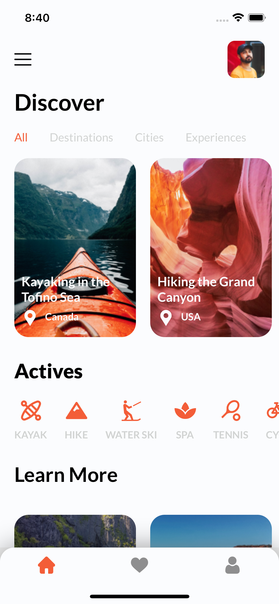
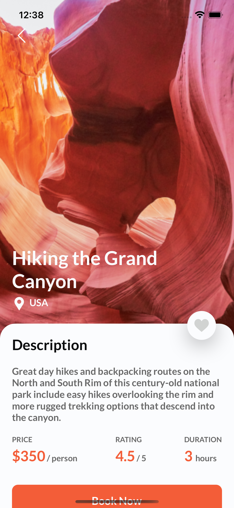
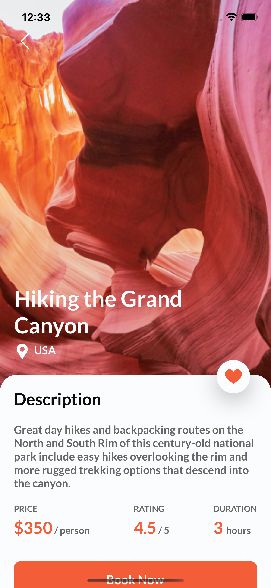

**Install Steps**

`npm i -g react-native`

**Runing Steps**

`npm install`

`npm run ios & npm run andriod` 

**Application Figma File**

`https://www.figma.com/file/JrMbD6m5fLpEeCWKy1J9si/Travel-App-UI-(Copy)?node-id=0%3A1`

**Application Screens**

_Home Page_

_Detail Unlike Page_

_Detail Liked Page_

